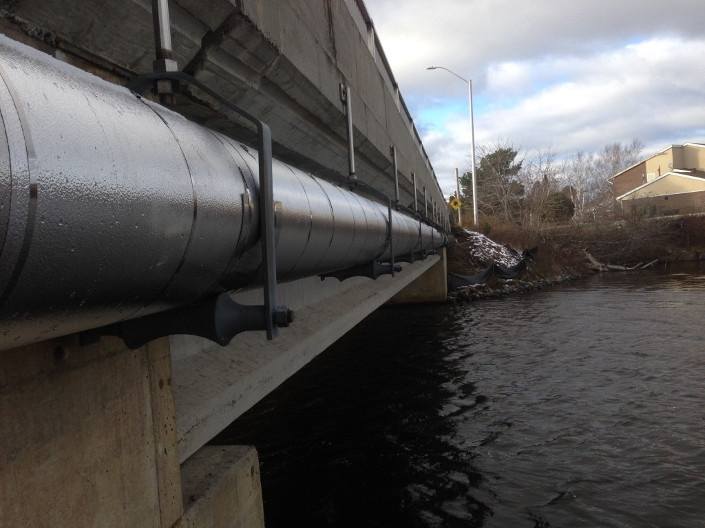
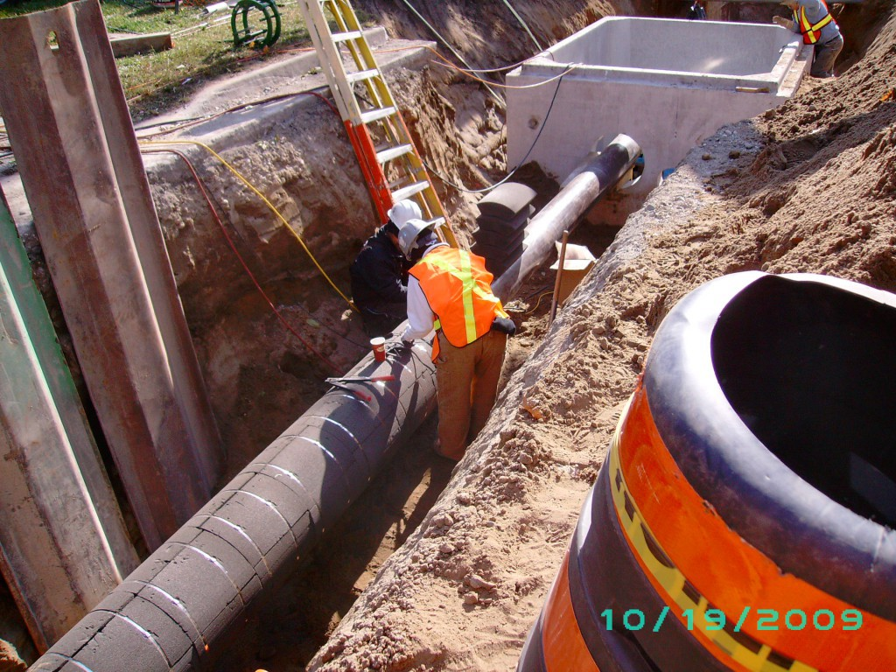
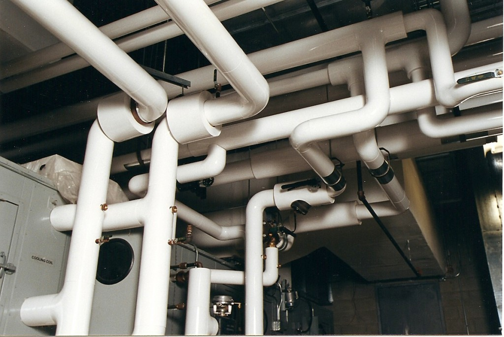

<h2>Applications</h2>

<section id="banner">
  

      <header>
          <h2>Cold Application </h2>
          Belform Interlocking System is ideal for underground piping applications, cold work applications, 
            and for piping along bridges, roofs, and towers, etc.
          A combination of Belform Styrofoam SM with a waterproof jacket, such as MFM Subseal #40 or #60, is the perfect fit. 
            If the piping is exposed to the weather, 
            stainless steel or aluminum jacket is required.
      </header>
  

  
      
  
</section>

<section id="banner">
  

      <header>
          <h2>Hot Application Below Ground </h2>
          Belform Insulation recommends our Belform Cellular Foam Glass line of products
           which is to be waterproofed with MFM Subseal #40 or #60, for 
            underground applications.
      </header>
  

  
      
  
</section>

<section id="banner">
  

      <header>
          <h2>General Insualtion </h2>
          For all of your general pipe insulation needs, 
            Belform recommends our line of Belform Insul-Phen phenolic products, 
            which is used in many types of systems, cold chilled, hot water, glycol, etc.
          Phenolic is not recommended for steam piping. Belform Insulation recommends Tornado Insulation Ltd. 
            for all of your mechanical insulation application needs.
      </header>
  

  
      
  
</section>